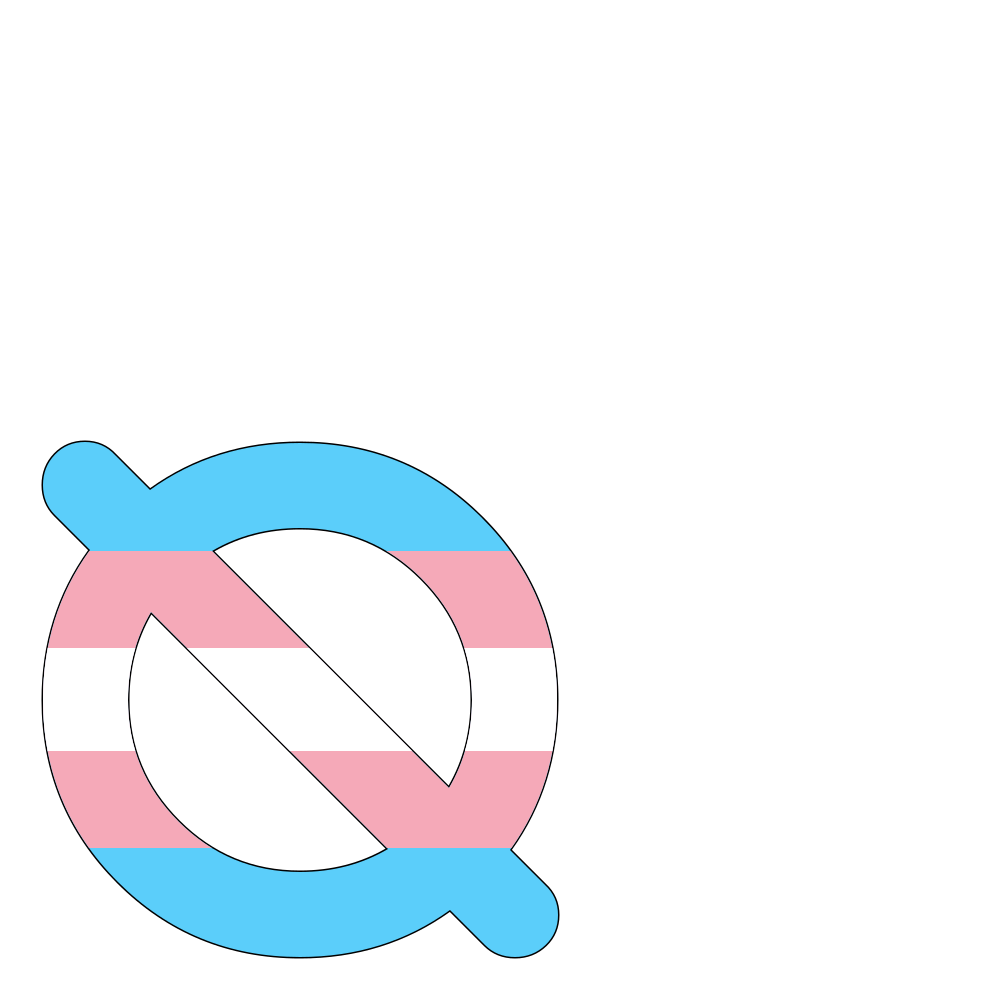
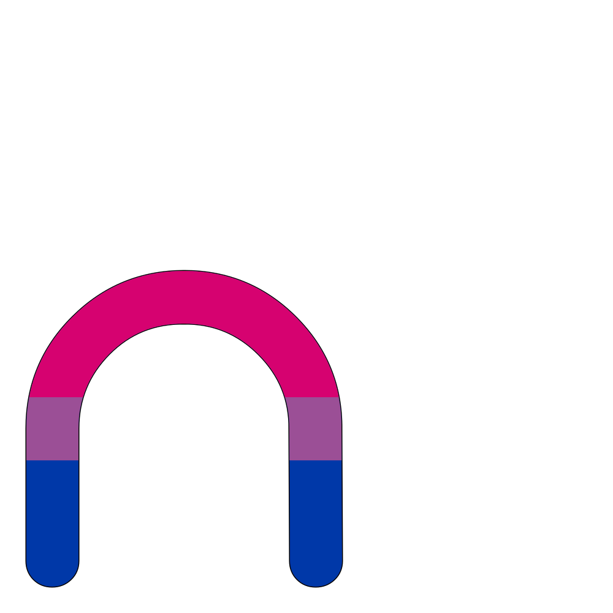

# Uiua386, colored

[demo and downloads](https://code.jonathanperret.net/uiua386color)

## why

Syntax highlighting can color Uiua's glyphs but not render the magnificent multi-color glyphs you can see in the [Uiua pad](https://uiua.org/pad) such as  or .

This font uses both the Opentype-SVG extension (for Firefox and Apple platforms) and the COLR1 extension (for Chrome) to render color glyphs using the official Uiua palette.

## requirements

```
$ python -mvenv venv
$ source ./venv/bin/activate
$ pip install -r requirements.txt
```

## build font

```
$ make
```

